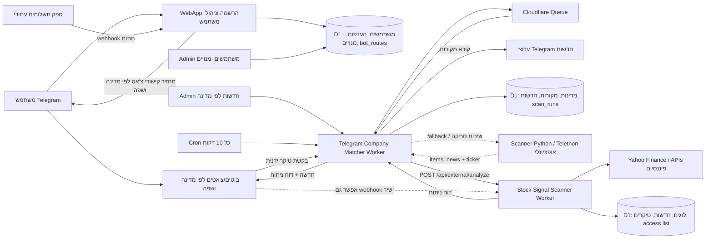

# סקירת פרויקט Market Signal AI

תאריך סקירה: 2026-06-10

## תמונת מצב

הפרויקט מורכב משלושה שירותים:

1. `market-signal-ai-bot` - שירות הרשמה, העדפות משתמש, מנויים, קישורי בוטים לפי מדינה ושפת משתמש, ואדמין מוניטורינג על Cloudflare Worker + D1.
2. `stock-signal-scanner` - מנוע ניתוח טיקרים. קיימות שתי שכבות: אפליקציית Python מקומית/שרתית, ושכבת Cloudflare Worker שמקבלת בקשות חיצוניות, מנתחת טיקרים, שומרת לוגים ושולחת לטלגרם.
3. `telegram_company_matcher_app` - סורק חדשות מטלגרם, מזהה חברות וטיקרים, מנהל מדינות/מקורות/צ'אטים, מפעיל Queue/Cron ב-Cloudflare, ושולח טיקרים לשירות הסריקה.

## אינפוגרפיקה ארכיטקטונית

## מה כבר חזק

- יש חלוקה עסקית נכונה: הרשמה/מנוי, איסוף חדשות, ניתוח טיקרים.
- שירות החדשות כבר כולל Cron, Queue ו-Dead Letter Queue, וזה בסיס טוב לפרודקשן.
- שירות החדשות כבר יודע למפות מדינה/שפה/צ'אט ולשלוח טיקר לשירות הסריקה.
- שירות הסריקה ב-Cloudflare כבר תומך ב-`/api/external/analyze`, token, לוגים, access-list וטלגרם.
- שירות ההרשמה כבר מאמת Telegram init data, שומר audit events ומטפל ב-subscription webhook עם HMAC.

## פערים מרכזיים

- אין עדיין חוזה מרכזי אחד בין שלושת השירותים. יש כמה פורמטים מקבילים: Python outbox, Worker payload, user bot routes.
- שירות המשתמשים ושירות החדשות מחזיקים שניהם מושגים של מדינה/שפה/בוט, אבל אין מקור אמת יחיד.
- שירות 2 בפרודקשן עדיין מצביע ב-`SCANNER_URL` לכתובת dev של monitor, וזה מסוכן לפרודקשן.
- ב-`telegram_company_matcher_app` יש גרסה מקומית Python וגרסת Cloudflare. צריך להחליט מי ה-runtime הרשמי.
- אין בדיקות אוטומטיות משמעותיות סביב החוזה: matcher -> scanner -> Telegram.
- אין rate limiting ברור לבקשות טיקר ידניות או לסריקות תכופות.
- חלק מהתיעוד בקידוד שבור, מה שיקשה על תחזוקה וצירוף מפתחים.

## סדר עדיפויות מומלץ

### שלב 1: לייצב MVP פרודקשן

1. להגדיר מקור אמת אחד למדינות, שפות וצ'אטים. המלצה: שירות ההרשמה מחזיק user access, שירות החדשות מחזיק routing תפעולי, ושניהם משתמשים באותם קודי מדינה ושפה.
2. לקבע חוזה API אחד בין שירות החדשות לשירות הסריקה, כולל `requestId`, `country`, `language`, `bot`, `news`, `tickers`, `analysis`, `delivery`.
3. להוסיף בדיקות contract ל-payload הזה בשני הצדדים.
4. לתקן קונפיג פרודקשן של `telegram_company_matcher_app`: D1 אמיתי, Scanner URL פרודקשן, secrets נפרדים, וללא תלות ב-dev monitor.
5. להוסיף health checks שמחזירים גם מצב DB, Queue ויכולת גישה לשירות הסריקה.

### שלב 2: אבטחה ותפעול

1. להוסיף rate limit לפי chat/user/ticker, במיוחד בבקשות ידניות.
2. להעביר tokens למודל סודות אחיד: ב-D1 נשמר רק שם הסוד, הערך נשאר ב-Cloudflare secrets.
3. להוסיף alerting על scan_runs שנכשלו, DLQ, וסריקות שלא שלחו הודעות.
4. להוסיף idempotency מלאה: אותה ידיעה מאותו ערוץ ומזהה הודעה לא צריכה להישלח פעמיים גם אם Queue רץ שוב.
5. לצמצם CORS פתוח באדמין וב-endpoints רגישים.

### שלב 3: מוצר וצמיחה

1. לחבר מנוי אמיתי לספק תשלומים ולנעול גישה לפי subscription פעיל.
2. ליצור מסך ניהול מרכזי אחד שמציג: משתמשים, מדינות, צ'אטים, סריקות, טיקרים, שגיאות, ושליחה אחרונה.
3. להוסיף watchlist אישי למשתמשים: טיקרים קבועים מעבר לחדשות.
4. להוסיף דירוג חשיבות לידיעה: sentiment, impact score, confidence.
5. להרחיב את מאגר החברות ולנהל aliases דרך UI, לא רק CSV.

## החלטות ניהוליות שצריך לקבל

- האם Cloudflare Workers הם ה-runtime הרשמי לכל שלושת השירותים, או ששירות Python נשאר כחלק פרודקשן?
- האם בוטים לפי מדינה הם צ'אטים ציבוריים, קבוצות פרטיות, או בוטים נפרדים?
- מי אחראי לשליחה הסופית לטלגרם: שירות החדשות או שירות הסריקה?
- האם מנוי הוא לפי מדינה/שפה, לפי כל המוצר, או לפי tier?
- האם משתמש יכול לקבל את אותה ידיעה בכמה שפות/מדינות או רק ערוץ אחד?

## המלצה ארכיטקטונית קצרה

המסלול הנקי ביותר: להפוך את `telegram_company_matcher_app` ל-orchestrator של חדשות ושליחה, ואת `stock-signal-scanner` למנוע ניתוח בלבד. שירות ההרשמה יישאר מקור האמת למשתמשים, מנויים והרשאות. כך כל שירות מקבל אחריות ברורה, ופחות לוגיקה כפולה בין בוטים, מדינות וניתוח.

