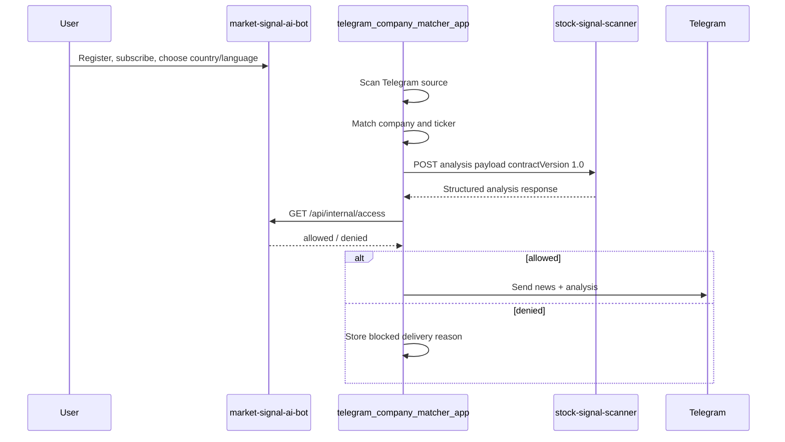

# SaaS Product Architecture

## Product Direction

Market Signal AI is one commercial SaaS product with a user account, subscription, website dashboard, Telegram delivery, and API access.

Telegram is an important delivery and interaction channel, but the main product center is the user's SaaS account.

## Core User Journey

1. User opens the website.
2. User signs up or logs in.
3. User chooses a subscription plan.
4. User selects countries, languages, and news channels.
5. User receives Telegram channel/bot access where allowed.
6. User can request ticker analysis from Telegram, the website, or API.
7. User can view API keys, usage, request history, and billing status in the account dashboard.

## Service Boundaries

### market-signal-ai-bot

Role: core account, subscription, access, and SaaS dashboard service.

Responsibilities:

- User registration and profile.
- Telegram WebApp onboarding.
- Subscription intake and status.
- Country/language preferences.
- Bot route visibility for allowed users.
- API keys and API usage tracking.
- Internal access decisions for other services.
- Admin monitoring for users, subscriptions, events, routes, and usage.

This service is the source of truth for users, subscriptions, access, API keys, and selected countries/languages.

### telegram_company_matcher_app

Role: news ingestion, company matching, ticker extraction, and delivery orchestration.

Responsibilities:

- Manage news countries, languages, sources, and delivery chats.
- Scan Telegram news sources.
- Find companies and tickers in news.
- Build `contractVersion: "1.0"` payloads for ticker analysis.
- Ask `market-signal-ai-bot` for access before user-targeted delivery.
- Send news and analysis to configured Telegram destinations.
- Track scan runs, delivery status, retries, and unsent messages.

This service must not own subscription logic.

### stock-signal-scanner

Role: ticker analysis engine.

Responsibilities:

- Accept ticker analysis requests.
- Validate contract payloads at runtime.
- Analyze tickers using configured strategies.
- Return structured analysis reports.
- Support idempotency by `requestId`.
- Send to Telegram only when explicitly requested and authorized by the orchestrator.

This service must not own user subscription logic.

## Source Of Truth

| Domain | Source of truth |
| --- | --- |
| Users | `market-signal-ai-bot` |
| Subscriptions | `market-signal-ai-bot` |
| API keys | `market-signal-ai-bot` |
| User country/language choices | `market-signal-ai-bot` |
| News sources | `telegram_company_matcher_app` |
| News scan runs | `telegram_company_matcher_app` |
| Ticker analysis logic | `stock-signal-scanner` |
| Analysis request history | `market-signal-ai-bot` for user/API history, `stock-signal-scanner` for engine logs |

## Critical Integration Flow

## Current Core Capabilities

The current core service already includes:

- Telegram init data verification.
- Subscription webhook HMAC verification.
- Internal access endpoint with Bearer/HMAC auth.
- D1 health checks.
- Rate limit storage.
- API key and usage tables.
- Basic Vitest coverage.
- Admin dashboard.

## Open Architecture Decisions

1. Final scanner analysis shape:
   - `risk`: numeric or enum.
   - `anchorBars`: number or interval array.
   - `strategies`: final allowed names.
2. Payment provider:
   - Stripe, Telegram Payments, another provider, or staged rollout.
3. API tiers:
   - request limits per plan.
   - country/language limits per plan.
   - manual analysis vs API analysis limits.
4. Delivery model:
   - public channels, private groups, country bots, or hybrid.
5. Final production environments:
   - dev, staging, production separation and domains.

