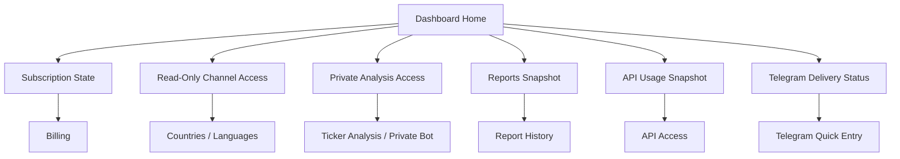

# SaaS UX v0.1

Owner: Glasha.
Status: ready for product review.
Last updated: 2026-06-23.

## UX Direction

Market Signal AI should feel like a commercial SaaS workspace first, with Telegram as a fast account and delivery control surface.

The website owns discovery, pricing, signup, onboarding, dashboard, ticker analysis, API access, reports, billing, and admin monitoring. Telegram owns quick account entry, read-only country/language news channel access, lightweight settings, private premium ticker requests, and delivery confirmations.

Country/language Telegram channels are read-only broadcast feeds. Personal ticker analysis is a separate premium action available only through the website, API, or a private Telegram bot flow after account, subscription, and quota checks.

## Dashboard UX Map

Primary dashboard goal: help a subscribed user understand account state, access state, signal activity, and next action without turning the page into a marketing surface.

Dashboard modules:

- Account header: workspace name, plan, renewal/access badge.
- Metrics strip: active feeds, reports generated, API calls, Telegram users/deliveries.
- Broadcast feed panel: selected read-only country/language channels and join/open actions.
- Private analysis panel: premium ticker analysis availability, quota, and entry points.
- News heat: topic/category intensity without investment-instruction language.
- Access panel: active, expired, blocked, or setup-required subscription state.
- Quick actions: join/read channels, start private bot, analyze ticker, open reports, manage API keys.
- Compliance notice: compact persistent note saying analysis is informational only.

## First Wireframe List

### Landing Page

- Top navigation: product, pricing, ticker analysis, API, Telegram entry, start trial.
- First viewport: product name, SaaS value proposition, primary CTA, product preview.
- Secondary band: signal workflow, subscriber access, admin monitoring.
- Legal note near hero CTA: informational market research only, not investment advice.
- Footer: Terms, Privacy, Risk Disclaimer, Subscription Terms, API Terms.

### Pricing

- Three cards: Starter, Pro, Desk.
- Each card shows limits: feeds, analysis/report volume, Telegram delivery, API access.
- Plan-area note from Oleg: plans provide research tools, not personalized advice.
- Checkout CTA must include unchecked renewal/risk acknowledgment before payment.

### Sign Up / Login

- Two-column layout: trust/product copy and compact form.
- Signup fields: email, password/magic link provider, workspace name.
- Email is required for every account, including Telegram-originated users.
- Required links: Terms, Privacy, Risk Disclaimer.
- Risk acknowledgment should not be pre-checked.
- Login should route to dashboard; signup should route to onboarding.

### Onboarding After Registration

- Stepper: choose markets, connect Telegram, activate plan, enable private analysis if plan allows.
- Country/language selection appears before Telegram delivery choice.
- Subscription/access state appears before final "Finish setup".
- Telegram connection is optional for website/API-only users, but required for private Telegram bot requests.
- Empty state: "No countries selected yet" with add-country action.

### User Dashboard

- Sidebar app navigation.
- Header with plan/access badge and primary action "Analyze ticker privately".
- Metrics strip and signal queue.
- Read-only channel access panel and private analysis quota panel.
- Persistent compliance notice.
- Expired state: account remains manageable; paid analysis, Telegram delivery, and API may be unavailable.

### Countries / Languages / Channels

- Country cards with language, read-only channel status, and linked Telegram channel.
- Active, draft, planned, and blocked status badges.
- Add/edit flow should show plan limits.
- Blocked state: "Not available on your current plan or subscription status."
- Card copy must say users read these channels; they do not submit ticker requests there.

### API Access

- API key list and create/rotate/revoke actions.
- Usage metrics: rate limit, calls, last success/error.
- Required API Terms checkbox before first key.
- Key creation warning: raw key is shown once only.
- API disclaimer near docs/example responses.

### Ticker Analysis

- Input/search row for ticker as private analysis.
- First-use disclaimer modal before first analysis.
- Result layout: summary, confidence, risk notes, strategy notes, source/news context.
- Copy must avoid buy/sell/hold instructions.
- Result footer disclaimer visible on every output.
- Request context must show where the private result is delivered: website result, API response, or private bot reply.

### Report History

- Filterable table: report title, market, status, created date, export action.
- Empty state: "No reports yet" with analyze ticker CTA.
- Report preview must show top disclaimer and export disclaimer.

### Billing / Subscription

- Current plan, renewal date, payment method, invoice list.
- Manage plan/cancel actions.
- Failed-payment state explains paid features may pause.
- Refund support copy links to Refund Policy.

### Admin Monitoring UI

- Auth gate with admin name/password.
- Overview metrics: users, active subscriptions, events, bot routes, API usage.
- Editable users table.
- Bot routes table with save/delete.
- Subscription/API usage panels.
- Right-side audit event log.
- Admin warning near destructive changes: admin actions may affect paid access and audit logs.

## Final Auth And Onboarding UX

### Signup Screen

Required fields and actions:

- Email address: required, verified before paid access.
- Workspace name: required for SaaS account setup.
- Auth method: Telegram login, Google login, or email link/password depending on final security decision.
- Terms, Privacy, and Risk Disclaimer acceptance: required and not pre-checked.
- Optional marketing consent: separate checkbox, not bundled with legal acceptance.

Primary states:

- Email missing: "Enter your email to create an account."
- Email already exists: "This email already has an account. Sign in instead."
- Email unconfirmed: "Check your inbox to confirm your email."
- Legal acceptance missing: "Accept the required terms to continue."

### Login Screen

Preferred layout:

- Primary button: continue with Google, if approved by security.
- Secondary button: continue with Telegram.
- Email option: magic link or password login after manager/security decision.
- Recovery link: resend email confirmation or reset password.

Copy rule: login copy must not imply that Telegram alone is the whole product. Telegram is a quick entry and delivery channel.

### Onboarding Screen

Stepper:

1. Confirm email.
2. Choose countries/languages.
3. Connect Telegram for delivery.
4. Choose plan or start checkout.
5. Accept required legal terms.

Onboarding must keep the user in the website SaaS workspace. Telegram linking is a step, not the primary destination.

## Telegram Login, Google Login, Email Confirmation

### Telegram Login

Purpose:

- Fast entry from Telegram.
- Account linking for Telegram delivery.
- Lightweight account and country/channel management.

UX requirements:

- Show Telegram display name and username after verification.
- Ask for required email if the Telegram user has no confirmed email.
- Show a confirmation screen before linking Telegram to an existing email account.
- If Telegram init data is invalid or expired, show "Open from Telegram again" with retry guidance.

### Google Login

Purpose:

- Website-first account login.
- Higher-trust business account onboarding.

UX requirements:

- Show the verified Google email before account creation.
- If the email already exists with Telegram, offer "Link Google to this account".
- If Google OAuth fails, show a neutral error and allow email/Telegram fallback.
- Do not show raw OAuth errors to users.

### Email Confirmation

Purpose:

- Make email mandatory and reliable for billing, recovery, legal notices, and account identity.

UX requirements:

- After signup, route to an email confirmation state.
- Allow resend with rate-limit messaging.
- Allow changing email before confirmation.
- Paid checkout should be blocked until email is confirmed unless manager explicitly accepts a different risk.

## Read-Only Channels And Private Premium Analysis

### Product Separation

The UI must make two capabilities feel related but separate:

- Read-only country/language channels: broadcast market news and informational signals to all channel subscribers who have access.
- Private ticker analysis: user-requested premium analysis returned only to that user through website, API, or private Telegram bot.

Do not use country/language channels as request surfaces. They are destinations for broadcast delivery only.

### Dashboard Controls

Dashboard should show two adjacent cards:

1. Channel access
   - Title: "Read-only news channels"
   - Status: active, pending setup, blocked, or unavailable.
   - Actions: open channel, manage countries/languages, upgrade if plan does not include the feed.
   - Copy: "These channels broadcast market news to subscribers. Do not send ticker requests here."

2. Private analysis
   - Title: "Private ticker analysis"
   - Status: available, upgrade required, quota reached, expired, or payment failed.
   - Actions: analyze ticker, start private bot, view API access, manage billing.
   - Copy: "Personal analysis requests are private and use your plan quota."

### Countries / Channels Screen

Each country/language card should include:

- Country and language.
- Channel type: "Read-only broadcast channel".
- Delivery destination: Telegram channel or website feed.
- Access state: active, no subscription, expired, pending route, planned.
- CTA: "Open channel" or "Manage access".
- Helper text: "Ticker requests are handled privately through the bot, website, or API."

### Private Ticker Analysis Entry Points

Website:

- Button: "Analyze ticker privately".
- Helper: "Private results are visible only in your account and report history."

Private Telegram bot:

- Button: "Start private bot".
- Helper: "Send ticker requests only in the private bot chat. Country channels are read-only."

API:

- Button: "Create API key".
- Helper: "API requests use plan quota and return private results to your integration."

### Telegram Onboarding Screens / Text

Screen 1: Connect Telegram

> Connect Telegram to open your news channels and optional private analysis bot.

Screen 2: Join news channels

> News channels are read-only broadcasts by country and language. Everyone with channel access can see channel messages.

CTA:

> Open read-only channel

Screen 3: Start private bot

> Use the private bot for personal ticker analysis. Results are sent only in your private chat and use your plan quota.

CTA:

> Start private analysis bot

Screen 4: Quota

> Private ticker requests use your plan quota. Channel broadcasts do not spend your personal analysis quota.

### Microcopy

Dashboard:

> Read-only channels broadcast market news to subscribers. Private ticker analysis is separate and uses your plan quota.

Channels page:

> Channel messages are visible to channel subscribers. Do not send ticker requests in country channels.

Private bot entry:

> Send ticker requests here for private analysis. Results are not posted to public or country channels.

Quota label:

> Private analysis quota

No premium access:

> Your plan includes read-only channel access, but private ticker analysis requires a premium plan.

Quota reached:

> You have used your private analysis quota for this period. Upgrade or wait for the quota reset.

Expired subscription:

> Your subscription has ended. Channel access and private analysis may be unavailable until you renew.

Public/private safety note:

> Channel broadcasts are shared with channel subscribers. Personal analysis results are delivered only through private bot, website, or API.

## Merchant Of Record Checkout UX

Target providers: Paddle or Lemon Squeezy.

Checkout entry points:

- Pricing page plan CTA.
- Billing page "Manage plan".
- Expired/no-subscription state "Renew access".
- Telegram WebApp subscription prompt should open website checkout, not host checkout inside Telegram.

Checkout UX principles:

- Use hosted MoR checkout or MoR-managed overlay when possible.
- Keep plan comparison on Market Signal AI; keep payment collection in the MoR checkout.
- Show recurring billing, renewal, cancellation, and refund notes before checkout.
- Use Oleg's required checkbox: "I understand that Market Signal AI is not investment advice and that my subscription renews automatically until canceled."
- Do not pre-check legal or commercial-use acceptance.

Post-checkout states:

- Success: return to billing/dashboard with "Plan active" and next renewal date.
- Pending: "Payment is processing. Access will update automatically."
- Failed: "We could not process your payment. Update payment method or try again."
- Canceled: return to pricing/billing with current access state.

## Disclaimer Component Inventory

Reusable components:

- `LegalInlineNotice`: compact notice for landing, dashboard, API, and reports.
- `LegalConsentCheckbox`: required unchecked checkbox for signup, checkout, and API Terms.
- `FirstTickerAnalysisModal`: first-use confirmation before ticker analysis.
- `OutputDisclaimerFooter`: footer below ticker outputs and reports.
- `TelegramStartDisclaimer`: `/start` and first-use Telegram disclaimer.
- `ApiTermsGate`: required acceptance before first API key.
- `ReportExportDisclaimer`: export confirmation that disclaimer remains attached.
- `AdminChangeWarning`: warning before admin changes that affect access, billing, API, or audit logs.

Placement rules:

- Never rely only on footer disclaimers for ticker analysis, checkout, API outputs, or Telegram first use.
- Keep notices compact and readable on mobile.
- Do not make legal text look like an error state.

## Access State UX

### Active

- Badge: "Active".
- Primary action: open read-only channels or analyze ticker privately.
- Secondary actions: start private bot, manage countries, API keys, billing.
- Copy: "Your plan is active. Read-only channels and private analysis are available within plan limits."

### Expired

- Badge: "Expired".
- Primary action: renew access.
- Keep available: account settings, billing, historical reports.
- Disable or gate: paid analysis, Telegram delivery, API key creation, API calls.
- Copy: "Your paid access has ended. You can still manage your account, but paid analysis, Telegram delivery, and API access may be unavailable until you renew."

### No Subscription

- Badge: "No subscription".
- Primary action: choose plan.
- Show limited product preview and account setup.
- Copy: "Choose a plan to unlock read-only channels, private ticker analysis, and API access."

### API Limit Reached

- Badge: "API limit reached".
- Primary action: upgrade plan or wait until reset.
- Show quota, reset time, and last API usage.
- Copy: "Your API limit for this period has been reached. Upgrade your plan or wait for the quota reset."

### Private Analysis Quota Reached

- Badge: "Private analysis quota reached".
- Primary action: upgrade plan or wait until reset.
- Keep read-only channel access visible if the subscription still allows it.
- Copy: "You have used your private ticker analysis quota for this period. Read-only channels may remain available under your plan."

### Payment Failed

- Badge: "Payment failed".
- Primary action: update payment method.
- Secondary action: contact support.
- Copy: "We could not process your payment. Paid features may be paused if payment is not updated."

## Admin UX Addendum

Admin sections:

- Countries/languages: table of countries, language, bot/channel route, active flag, linked users, last update.
- Subscriptions: user, plan, status, renewal/current period end, provider ID, last event.
- API usage: active keys, calls by day, top endpoints, limit pressure, recent errors.
- Delivery errors: request ID, user, country/language, service, status, attempt count, next retry, error summary.
- Audit log: immutable stream of user, admin, subscription, API, and delivery events.

Admin UX rules:

- Put destructive actions behind confirmation.
- Show the actor, target user, and impact before saving admin changes.
- Use filters before pagination for users, subscriptions, and delivery errors.
- Keep raw secrets hidden; show prefixes only.
- Avoid editing production bot routes without visible environment label.

## Legal And Disclaimer UX Points

Use Oleg's UI text from:

- `docs/legal/disclaimer-ui-points.md`
- `docs/legal/ui-legal-microcopy.md`
- `docs/legal/forbidden-product-phrases.md`

Required placements:

- Landing: hero CTA area and footer links.
- Pricing: plan comparison, checkout CTA, subscription acknowledgment checkbox.
- Signup: account creation consent links and optional risk acknowledgment.
- Dashboard: compact persistent informational-only notice.
- Ticker analysis: above form, first-use modal, and below generated output.
- API access: API Terms checkbox before first key and disclaimer near output examples.
- Reports: top notice, report footer, export confirmation.
- Telegram: `/start`, before first analysis, and short footer where practical.
- Billing: renewal/cancellation/refund notes.
- Admin: warning before user/payment/access changes.

Forbidden copy:

- Do not use hard-banned phrases from `docs/legal/forbidden-product-phrases.md`.
- Avoid unqualified "signal" language when it sounds like an instruction.
- Prefer "market analysis", "ticker context", "scenario analysis", "risk notes", and "informational research".

## UX States

### Empty

- Dashboard: no signal history yet; show "Run ticker analysis" and "Choose countries".
- Reports: no reports yet; show "Analyze your first ticker".
- API: no keys yet; show "Create API key" plus API Terms checkbox.
- Countries: no countries selected; show country/language picker.
- Admin: no rows returned; show filters and "No matching records".

### Loading

- Use compact in-panel loading states, not full-page spinners.
- Keep navigation visible.
- For admin tables, show "Loading admin panel..." status strip.
- For ticker analysis, show progress near the form and keep previous result visible until replaced.

### Error

- Use plain recovery copy: "Could not save", "Could not load", "Try again".
- Show field-level errors for email, missing country, missing key name, invalid Telegram URL.
- API/auth errors should avoid exposing secrets or stack traces.

### Blocked

- Copy: "This feature is not available on your current plan or subscription status."
- Show one recovery CTA: manage billing, choose plan, or contact support.
- Keep account/profile settings accessible.

### Expired

- Copy from Oleg: "Your paid access has ended. You can still manage your account..."
- Disable paid analysis, Telegram delivery, and API actions.
- Keep reports/account/billing accessible.
- Show renewal CTA and current subscription details.

### Rate Limited

- Show retry-after timing where available.
- Keep user data visible.
- For API page, explain plan quota/rate limit rather than blaming the user.

## Telegram WebApp Versus Full Website

Telegram WebApp should include:

- Quick account registration from Telegram init data.
- Email capture and basic profile confirmation.
- Country/language selection for read-only Telegram news channels.
- View linked read-only channel links.
- Remove a linked channel from the account.
- Start private Telegram bot flow if the plan allows personal ticker analysis.
- Show private analysis quota status.
- Subscription unlock prompt or checkout redirect.
- Short legal notice and `/start` disclaimer.

Full website should include:

- Landing and pricing.
- Full signup/login and onboarding.
- Dashboard and signal queue.
- Ticker analysis workspace.
- Private ticker analysis quota and plan gating.
- Report history and exports.
- API key management, usage, and API Terms acceptance.
- Billing/subscription management.
- Admin monitoring.
- Full legal links, detailed disclaimers, and account settings.

Do not put heavy SaaS workflows into Telegram:

- Payment plan comparison.
- API key creation/rotation.
- Report archive management.
- Admin monitoring.
- Dense ticker analysis review.
- Country/language broadcast channel request handling.

## Open UX Questions

- Final website auth method: Telegram-only, email magic link, password auth, or external identity provider.
- Payment provider and checkout embedding model.
- Final first-supported country/language launch list.
- API customers may display outputs only with attribution, visible disclaimers, and plan restrictions; resale or redistribution requires a written agreement.
- Final report export format and disclaimer placement.
